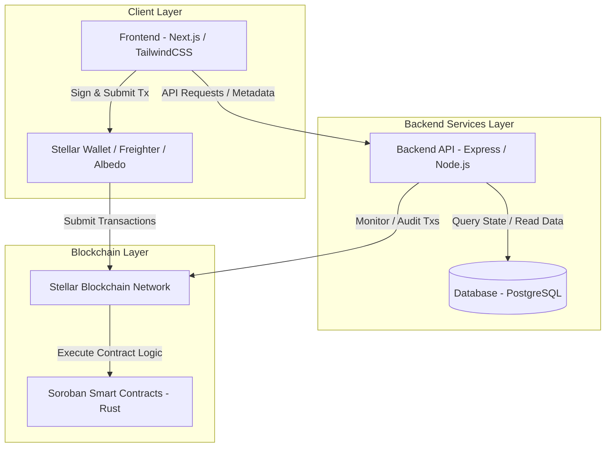

# SplitNaira Architecture Overview

This document provides a high-level architecture overview of SplitNaira, detailing how the frontend, backend API, smart contracts, and the Stellar blockchain relate to each other.

## System Overview

SplitNaira is an automated royalty splitting platform built for Nigeria's creative economy. It uses Soroban smart contracts on the Stellar blockchain to enable transparent revenue distribution among creators, collaborators, and stakeholders.

## Architecture Diagram

See [Split Lifecycle Architecture](./split-lifecycle-architecture.md) for how
a single project actually moves through create, fund, distribute, and
observe across these components, including trust boundaries.

## Components

### Frontend (Next.js)
- **Framework**: Next.js (App Router), TypeScript, TailwindCSS.
- **Responsibilities**: User interface for managing splits, connecting Stellar wallets (Freighter/Albedo), preparing transaction parameters, and displaying payout analytics.

### Backend API (Express / Node.js)
- **Framework**: Node.js, Express, TypeScript.
- **Database**: PostgreSQL.
- **Responsibilities**: Off-chain metadata storage, user management, audit logging, health metrics, and serving data to the frontend.

### Smart Contracts (Soroban)
- **Language**: Rust (`soroban-sdk`).
- **Target**: `wasm32v1-none`.
- **Responsibilities**: On-chain split calculations, fund custody/distribution, payout execution, and event generation.

### Stellar Blockchain
- **Network**: Stellar Testnet & Mainnet.
- **Responsibilities**: Transaction processing, ledger state management, payment settlement, and multi-asset transfers (XLM, USDC, stablecoins).

## Data Flow & Interactions

1. **Split Contract Creation**: Frontend prepares contract initialization parameters $\rightarrow$ Wallet signs transaction $\rightarrow$ Soroban contract deploys split instance on Stellar ledger.
2. **Revenue Distribution**: Funds arrive at split contract $\rightarrow$ Execution function triggered $\rightarrow$ Contract divides funds according to percentage shares $\rightarrow$ Direct settlement on Stellar network.
3. **Indexing & Analytics**: Backend service monitors ledger events $\rightarrow$ Persists transaction history to PostgreSQL $\rightarrow$ Exposes analytics via API to Frontend.

## Security & Authentication

- Smart contract calls require Soroban cryptographic authorization (`address.require_auth()`).
- Backend endpoints enforce administrative API keys and rate-limiting middleware.
