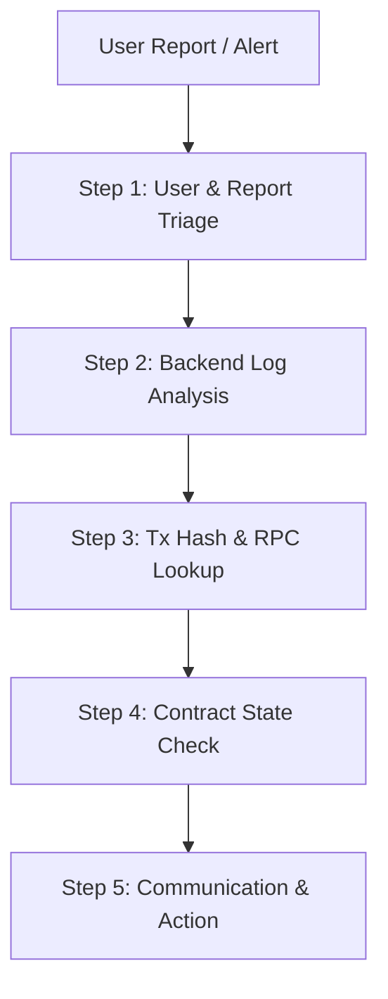

# Stuck or Delayed Payouts Incident Response Runbook (#861)

## Purpose

This runbook defines the operational incident response protocol for SplitNaira payment operations when encountering delayed payouts, stuck transactions, Stellar/Soroban RPC degradation, or partial distribution failures. It provides step-by-step triage procedures, rules for disabling admin write operations, escalation criteria, and recovery guidelines.

---

## Incident Scenarios & Classification

| Scenario | Symptom / Error | Root Cause |
|----------|-----------------|------------|
| **Delayed Payout** | Transaction submitted but pending confirmation for > 3 minutes | Soroban RPC network congestion, low fee bump, or ledger inclusion delay |
| **Stuck Transaction** | Transaction fails with sequence/nonce mismatch or expired fee | RPC node out of sync, bad transaction sequence, or unconfirmed prior submit |
| **RPC Degradation** | Backend throws `ErrorType.RPC` or timeout errors | RPC provider outage, rate-limiting (429), or RPC endpoint network partition |
| **Partial Distribution** | Contract `distribute` fails mid-round or balance remains partially allocated | Contract pause, insufficient token balance, basis point calculation edge case |
| **Data Sync Lag** | On-chain payout succeeded (`payment_sent` event emitted) but backend DB shows pending | `EventListenerService` lag, missing event block range, or DB write failure |

---

## Triage Protocol

When an incident is reported or detected, perform the following 5-step triage sequence in order.



### Step 1: User Report & Initial Triage

1. **Collect Key Metadata**:
   - `walletAddress` (Stellar G... address of sender or recipient)
   - `projectId` (Symbol / string identifier of the split project)
   - `txHash` (64-character hex transaction hash, if provided or available)
   - Approximate timestamp of deposit or distribution initiation
   - Reported error message or UI state screenshot

2. **Categorize Scope**:
   - Single user / single project vs. systemic across multiple projects.

---

### Step 2: Backend Log Analysis

1. **Obtain Correlation ID**:
   - Locate the `x-correlation-id` or `requestId` from the client response header or error payload.

2. **Search Application Logs**:
   - Filter Winston JSON logs in Render / Sentry / log aggregator using:
     ```json
     { "requestId": "<REQUEST_ID>" }
     ```
   - Or search by `walletAddress` / `projectId` / `txHash`:
     ```json
     { "projectId": "<PROJECT_ID>" }
     ```

3. **Analyze Error Signatures**:
   - `ErrorType.RPC` / `ErrorCode.RPC_ERROR`: Soroban RPC node communication failure.
   - `ErrorType.SMART_CONTRACT` / `DistributionsPaused`: Contract distribution pause active.
   - `ErrorType.VALIDATION`: Malformed query parameter or wallet address format.
   - Look for retry logs (`EventListenerService` retries, Stellar RPC retry back-offs).

---

### Step 3: Transaction Hash & RPC Lookup

1. **Internal API Verification**:
   - Query the backend transaction lookup endpoint:
     ```bash
     GET /transactions/:txHash
     ```
   - Check status, block height, and timestamp returned by `PayoutHistoryService`.

2. **On-Chain & Horizon Verification**:
   - Search the transaction hash on StellarExpert or via Horizon RPC endpoint:
     ```bash
     curl -s "https://horizon-testnet.stellar.org/transactions/<TX_HASH>"
     ```
   - Interpret Stellar transaction status:
     - **SUCCESS** (`txSUCCESS`): Transaction confirmed on-chain. Verify `payment_sent` or `distribution_complete` event topics.
     - **FAILED** (`txFAILED`): Transaction rejected on-chain. Check `result_codes` (e.g., `op_underfunded`, `op_bad_auth`).
     - **NOT FOUND (404)**: Transaction was never submitted or was dropped from mempool (e.g., expired timebounds/fee).

---

### Step 4: Smart Contract State Check

1. **Read-Only Contract Diagnostics**:
   - Query project details via backend:
     ```bash
     GET /api/splits/:projectId
     ```
   - Check contract pause status:
     - Verify if `is_distributions_paused()` returns `true`.
   - Inspect project balances and claims on-chain:
     - `get_project(project_id)` — Verify project existence, lock state, total distributed.
     - `get_balance(project_id)` — Confirm remaining project-scoped balance.
     - `get_claimable(project_id, collaborator)` — Verify individual claimable info and `distribution_round`.

2. **Check Operational Status**:
   - Check backend event listener and DB state:
     ```bash
     GET /ops/status
     ```
   - Confirm `eventListener` health is `ok` and `database.connected` is `true`.

---

### Step 5: Communication Procedures

1. **Internal Incident Channel**:
   - Post an initial incident notification in `#incidents-payments`:
     - **Incident Title**: Delayed Payout / RPC Degradation / Stuck Tx
     - **Impact**: Single project / Multi-project / System-wide
     - **Status**: Investigating
     - **Correlation ID / TxHash**: `<ID>`

2. **External User Communication**:
   - If payout delays exceed 15 minutes, update the public Status Page ("Payout Processing Delays").
   - Send standardized response to affected users:
     > *"We are currently investigating a delay in payout processing on the Stellar network. Your funds are safe in the smart contract balance. Please do not re-submit distribution attempts while our engineers resolve the issue."*

---

## Disabling Admin Writes & Safety Controls

When risk of data corruption, double-payouts, or contract inconsistency is identified, payment operations MUST enforce safety freezes.

### When to Disable Admin Writes

Disable writes immediately under any of the following conditions:
1. **Unconfirmed Submission Loops**: Backend or user retries are generating multiple unconfirmed transactions for the same distribution round.
2. **Contract State Discrepancy**: DB recorded balance differs from on-chain `get_balance(project_id)`.
3. **RPC Network Partition / Fork**: Soroban RPC nodes returning conflicting ledger states.
4. **Security Alert / Admin Credential Exposure**: Suspected unauthorized access to payments admin API keys or wallet keys.
5. **Partial Distribution Reversal Failure**: A multi-beneficiary `distribute` call reverted after partial transfers (requires investigation).

### How to Disable Admin Writes

#### 1. Backend Level Lock (`PAYMENTS_ADMIN_WRITE_ENABLED=false`)

Set environment variable on the backend service:
```bash
PAYMENTS_ADMIN_WRITE_ENABLED=false
```
Restart or redeploy backend. All non-GET requests to `/splits/admin/*` will immediately be rejected with:
```json
HTTP 503 Service Unavailable
{
  "error": "payments_admin_writes_disabled",
  "message": "Payments admin write operations are temporarily disabled.",
  "details": { "rollbackAware": true }
}
```

#### 2. Smart Contract Distribution Pause (`pause_distributions`)

If contract-level payout freezing is required, invoke `pause_distributions` using the admin Stellar wallet:
```bash
# Using Soroban CLI with contract admin identity
soroban contract invoke \
  --id <CONTRACT_ID> \
  --source admin \
  --network <NETWORK> \
  -- \
  pause_distributions \
  --admin <ADMIN_ADDRESS>
```
Once paused, all `distribute`, `batch_distribute`, and `claim` calls will revert on-chain with `SplitError::DistributionsPaused` (code 16). Deposits and read queries remain active.

> **Fully distributed projects:** `claim` returns `DistributionsPaused` during a pause even when the project balance is already 0 and even for non-collaborators. The pause check runs before the balance and membership checks. After unpause, the same call returns `0` and moves no funds. Deposits made during the pause become claimable only after unpause. Payout history (`get_claimed`, `get_claimable`, `get_balance`) stays readable throughout. Tests covering this behavior are in `contracts/pause_claim_tests.rs`.

### Safe Re-Activation Protocol

Before re-enabling admin writes or unpausing contract distributions:
1. Confirm RPC endpoints and event listener indexing have fully caught up (`GET /ops/status`).
2. Run database event backfill if events were missed:
   ```bash
   POST /ops/backfill
   { "fromLedger": <LAST_KNOWN_GOOD_LEDGER> }
   ```
3. Re-enable backend admin writes (`PAYMENTS_ADMIN_WRITE_ENABLED=true`).
4. Invoke `unpause_distributions(admin)` on the smart contract.
5. Confirm `/health/ready` returns `200 OK`.

---

## Escalation Criteria & Matrix

Incidents are classified into three severity levels with strict response time SLAs and escalation paths.

```
       Severity Matrix
┌───────────────────────────────┐
│ P1 CRITICAL (SLA: 15 mins)    │  --> Incident Commander, Lead Blockchain Eng, Security Lead
├───────────────────────────────┤
│ P2 MAJOR    (SLA: 30 mins)    │  --> On-call Backend / DevOps Engineer
├───────────────────────────────┤
│ P3 MINOR    (SLA: 2 hours)    │  --> Customer Support / Tier 2 Triage
└───────────────────────────────┘
```

### Escalation Matrix

| Severity | Criteria | Response SLA | Escalation Target |
|----------|----------|--------------|-------------------|
| **P1 Critical** | • Systemic payout failure across > 5 projects<br>• Smart contract state corruption or accounting discrepancy<br>• Compromise of admin private keys or API keys<br>• Total Soroban RPC outage lasting > 15 mins | **15 minutes** | • Incident Commander<br>• Lead Blockchain/Soroban Engineer<br>• Security Officer<br>• Operations Lead |
| **P2 Major** | • Single project payout failure unresolvable by retry<br>• RPC degradation causing high latency (> 10s) or retry rate > 20%<br>• Event listener stream disconnected > 30 mins<br>• Partial distribution failure requiring manual backfill | **30 minutes** | • On-call Backend Engineer<br>• DevOps / Infrastructure Lead |
| **P3 Minor** | • Transient UI payout status sync delay (< 15 mins)<br>• Single user query regarding pending transaction<br>• Backfill script needed for isolated historical ledger | **2 hours** | • Tier 2 Support<br>• Backend Engineer (Business Hours) |

---

## Related Runbooks & Documentation

- [Rollback Guide](../../runbooks/rollback-guide.md) — Operational instructions for service and contract rollback
- [Ops Deployment & Rollback](./ops-deployment-rollback.md) — Contract metadata sync and deployment verification
- [Observability Runbook](./observability.md) — Health probes, Prometheus metrics, and log correlation IDs
- [CI/CD Incident Management](./incident-management.md) — Pipeline and production runtime incident procedures
- [Contract Release & Upgrade](../contract-release-and-upgrade-runbook.md) — Soroban smart contract lifecycle and upgrade runbook
