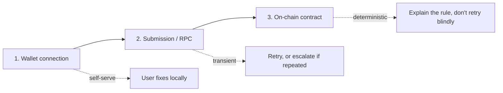

# Support Escalation Guide: Failed Wallet Submissions

Issue #1162. This guide is for support/on-call handling a user report of
"my wallet transaction failed" or "nothing happened when I tried to
connect/deposit/distribute". It classifies failures by where they actually
occurred, tells you what a user can fix themselves, and when to escalate to
backend/contracts on-call.

This is a **triage guide**, not an incident runbook — for systemic RPC
degradation or stuck payouts affecting many users, use the
[Stuck Payouts Incident Response Runbook](./stuck-payouts.md) instead. Use
this guide when a single user (or a handful) reports a failed submission and
you need to figure out which of the three layers below is actually at fault.

## The Three Failure Layers

A "wallet submission" can fail at three genuinely different points, and the
fix (and who owns it) is different at each:

## Step 1: Collect the Basics

Before triaging, get from the user (or the error report):

- The wallet address (Stellar `G...` address)
- What action they were attempting (connect, deposit, distribute, claim,
  create project)
- The exact error text or a screenshot
- A transaction hash, if one was ever generated (this alone tells you the
  failure was at Layer 2 or 3, not Layer 1 — see below)

## Layer 1: Wallet Connection Failures

**Symptom:** nothing happens, or an error appears before any transaction
hash exists.

| What the user sees                                   | Likely cause                                                 | Fix                                                                                                                   |
| ---------------------------------------------------- | ------------------------------------------------------------ | --------------------------------------------------------------------------------------------------------------------- |
| No wallet prompt appears at all                      | Freighter/Albedo extension not installed                     | Point them to install it; this is self-serve, not a backend issue.                                                    |
| "Wrong network detected"                             | Wallet is on Testnet/Mainnet, app expects the other          | See [Wallet Network Mismatch](../troubleshooting/wallet-network-mismatch.md) — user-fixable in their wallet settings. |
| Prompt appears, user clicks approve, nothing happens | User actually rejected/closed it, or the extension is locked | Ask them to unlock the wallet extension and retry. Not a backend issue.                                               |

**Escalate only if:** the same user reports this consistently across
different browsers/devices with a correctly-configured wallet and network —
that could indicate a frontend regression in wallet-detection logic
(`frontend/src/lib/freighter.ts`, `frontend/src/hooks/useWallet.ts`), not a
user error.

## Layer 2: Submission / RPC Failures

**Symptom:** the wallet prompted and the user approved, but the action
still failed — with or without a transaction hash.

| Error                                            | Meaning                                                                                                          | Action                                                                                                                                                                                                                                                                                                                                                                    |
| ------------------------------------------------ | ---------------------------------------------------------------------------------------------------------------- | ------------------------------------------------------------------------------------------------------------------------------------------------------------------------------------------------------------------------------------------------------------------------------------------------------------------------------------------------------------------------- |
| `TimeoutError` / "Unexpected transaction status" | The transaction was submitted but polling for confirmation timed out (`frontend/src/lib/soroban-transaction.ts`) | Get the tx hash if one exists and look it up directly on [Stellar Expert](https://stellar.expert) or Horizon — it may have actually succeeded even though the UI timed out. Don't assume failure from a timeout alone.                                                                                                                                                    |
| "Transaction rejected by the network."           | The RPC's `sendTransaction` call itself was rejected (not a contract error)                                      | Check backend RPC retry metrics — see [RPC Retry Observability](./observability.md#rpc-retry-observability-issue-836) for exhaustion/timeout signals. If retries are exhausted for `simulateTransaction`/`sendTransaction` broadly (not just this one user), this is systemic — escalate to backend on-call and consider the [Stuck Payouts runbook](./stuck-payouts.md). |
| Repeated failures for one user, none for others  | Likely that user's wallet is out of sync (stale sequence number) or has a fee-bump issue                         | Not a backend bug per se; ask the user to reconnect their wallet and retry. If it persists, escalate — could indicate an account state edge case worth a closer look.                                                                                                                                                                                                     |

**Escalate to backend on-call if:** `sse_disconnects_total` or
`splitnaira_rpc_retry_max_attempts_reached_total` show a spike correlated
with the report timeframe (see [Observability Runbook](./observability.md))
— that means the user's report is a symptom of a real backend/RPC problem,
not an isolated case.

## Layer 3: On-Chain Contract Rejections

**Symptom:** the transaction reached the network and was rejected by the
contract itself — deterministic, not transient. **Don't tell the user to
"just try again"** for these; the same input will fail the same way every
time until the underlying condition changes.

The frontend already translates every contract error code
(`contracts/errors.rs` / `SplitError`) into a plain-language message via
`frontend/src/lib/contract-errors.ts`. If a user reports one of these, the
message they saw already tells you the actual cause — support's job is to
confirm which rule applies, not to guess:

| Error the user sees                                                  | What's actually happening                                                                    | Is this fixable by the user?                                                                                                                                  |
| -------------------------------------------------------------------- | -------------------------------------------------------------------------------------------- | ------------------------------------------------------------------------------------------------------------------------------------------------------------- |
| "A project with this ID already exists."                             | `ProjectExists` — someone (possibly the same user, twice) already used this exact project ID | Yes — pick a different ID.                                                                                                                                    |
| "Collaborator shares must total exactly 10,000 basis points (100%)." | `InvalidSplit`                                                                               | Yes — fix the split percentages before resubmitting.                                                                                                          |
| "You are not authorized for this action."                            | `Unauthorized` — wrong wallet connected for an owner/admin-only action                       | Yes — connect the correct wallet.                                                                                                                             |
| "There is no balance available to distribute for this project."      | `NoBalance`                                                                                  | Not a bug — nothing to distribute yet. Confirm a deposit actually landed first.                                                                               |
| "This project is locked." / "already locked"                         | `ProjectLocked` / `AlreadyLocked`                                                            | No — locking is intentionally irreversible by design; a new project is required.                                                                              |
| "Distributions are paused by the contract admin."                    | `DistributionsPaused`                                                                        | No — this is an intentional admin action, not a bug. Check with the admin/on-call for why distributions are paused before telling the user to retry.          |
| "An internal balance calculation overflowed."                        | `ArithmeticOverflow`                                                                         | **No — escalate immediately.** This should not happen under normal use; treat as a contract-level bug report, get the tx hash, and hand to contracts on-call. |
| "Contract accounting detected a balance mismatch."                   | `AccountingDiscrepancy`                                                                      | **No — escalate immediately**, same as above.                                                                                                                 |

**Always escalate `ArithmeticOverflow` and `AccountingDiscrepancy` reports
directly to contracts on-call**, regardless of how minor the user makes it
sound — these two indicate the contract's internal bookkeeping disagreed
with itself, which is a correctness issue, not a user-facing edge case.

For anything not in this table, check `frontend/src/lib/contract-errors.ts`
directly for the full, current list — contract error codes get added over
time and this guide summarizes the common ones, not necessarily all of them.

## When in Doubt

If you can't tell which layer the failure is at from the error text alone,
ask the user for the transaction hash. Its presence or absence tells you
immediately: no hash means Layer 1, a hash that never confirmed means
Layer 2, a hash with a failed/rejected on-chain result means Layer 3.

## Related

- [Wallet Network Mismatch Troubleshooting](../troubleshooting/wallet-network-mismatch.md)
- [Stuck Payouts Incident Response Runbook](./stuck-payouts.md)
- [Observability Runbook](./observability.md)
- [Wallet Signing Threat Model](../wallet-signing-threat-model.md)
