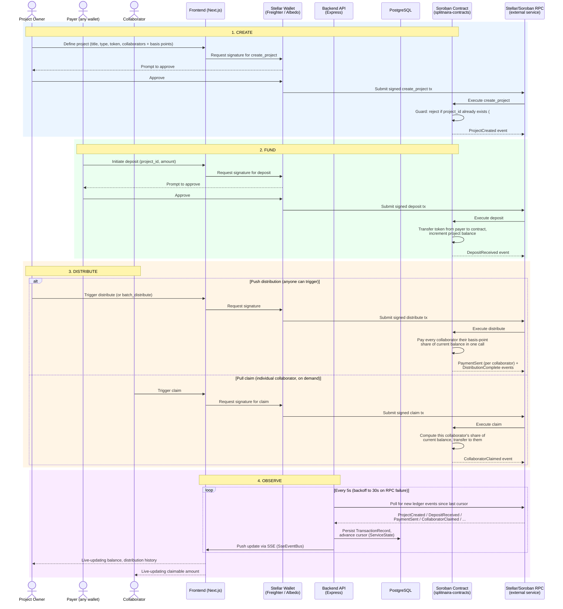

# Split Lifecycle Architecture Diagram (#903)

> **Issue:** #903
> **Track:** Stellar Wave
> **Status:** Complete

## Purpose

[docs/ARCHITECTURE.md](./ARCHITECTURE.md) shows the static system components
(frontend, backend, contracts, Stellar network) and how they're layered. This
document is complementary: it shows the actual **lifecycle of a split
project** as it moves through the system — create, fund, distribute, and
observe — including which service each step talks to, which steps require a
wallet signature, and where the trust boundaries are.

## Split Lifecycle

## Trust Boundaries and External Services

| Boundary | What crosses it | Who/what is trusted |
|----------|------------------|----------------------|
| **User ↔ Wallet extension** | The transaction to be signed (unsigned XDR) | The wallet (Freighter/Albedo) is the only party that ever holds the signing key. The backend never sees or handles private keys — see [wallet-signing-threat-model.md](./wallet-signing-threat-model.md). |
| **Frontend ↔ Backend** | API requests/metadata only, never a signing key | Frontend is treated as untrusted input by the backend; all state-changing outcomes are ultimately verified on-chain, not taken on the frontend's word. |
| **Wallet ↔ Stellar/Soroban RPC** | Signed transactions | RPC is an **external service** (not operated by SplitNaira) — the create/fund/distribute paths all depend on its availability. The backend's Observe loop treats RPC failures as a first-class case (error-count backoff, not a crash). |
| **Backend ↔ RPC (read path)** | Polling for ledger events | Read-only; the backend cannot mutate on-chain state through this path, only observe it. |
| **Contract-internal** | `create_project`'s duplicate-id guard, `deposit`'s balance accounting, `distribute`/`claim`'s payout math | This is the actual source of truth. The backend's PostgreSQL copy is a read cache for fast queries/history — if it disagrees with the chain, the chain wins. |

## Notes on Push vs. Pull Distribution

The contract supports two independent ways money actually reaches a
collaborator, and both are shown in step 3 above because either can happen at
any time once a project has a balance:

- **`distribute` / `batch_distribute`** — permissionless; anyone can call it,
  and it pays out every collaborator's share of the current balance in one
  transaction.
- **`claim`** — an individual collaborator can pull just their own share on
  demand, independent of whether anyone has called `distribute`.

Both mutate the same on-chain balance and both emit events the backend's
Observe loop picks up identically.

## Related

- [Architecture Overview](./ARCHITECTURE.md) — static component/layer diagram
- [Wallet signing threat model](./wallet-signing-threat-model.md)
- [Contract events reference](./contract-events.md)
- [Backend performance (Wave 5)](./backend-performance-wave5.md)
